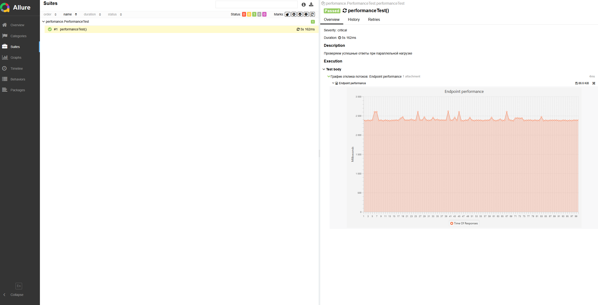
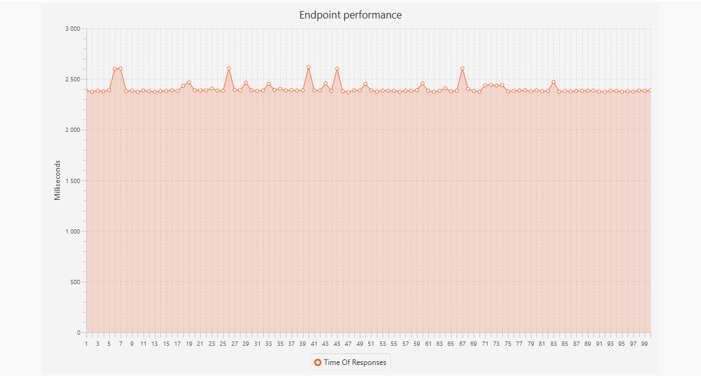

# Performance-Test

Проект для нагрузочного тестирования API и генерации графика времени отклика потоков с использованием **JUnit 5**, **RestAssured**, **Allure** и **JavaFX**.

---

### 📂 Структура проекта

- `PerformanceTest` — основной тест параллельной нагрузки.
- `RestAssuredThread` — класс потока, выполняющего HTTP-запросы.
- `ChartCreator` — создание графиков времени отклика и прикрепление их к Allure.

---

### Установка и запуск

1. Клонируйте или скачайте проект.
2. Откройте проект в вашей IDE или через терминал.
3. Убедитесь, что установлен Maven и Allure CLI:

```bash
mvn -v
allure --version
````
```
mvn clean test
allure serve allure-results
```
💡 Примечание: Папка allure-results генерируется в корне проекта после прогона тестов.

### Как работает тест

- Создаётся 100 потоков, каждый выполняет запрос к указанному API.
- Фиксируется время отклика каждого потока.
- В конце теста формируется график времени отклика всех потоков.
- Все результаты (включая график) прикрепляются к Allure Report.



### Комментарии
Проект создан для демонстрации нагрузочного тестирования с визуализацией результатов.